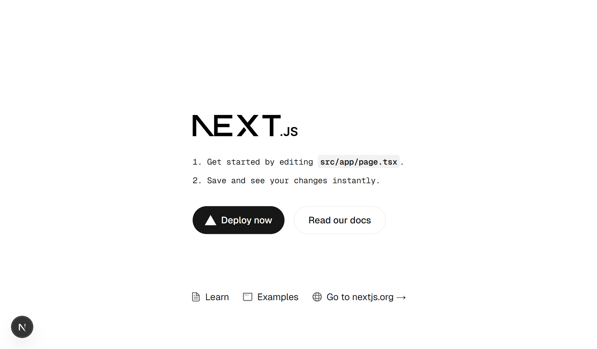
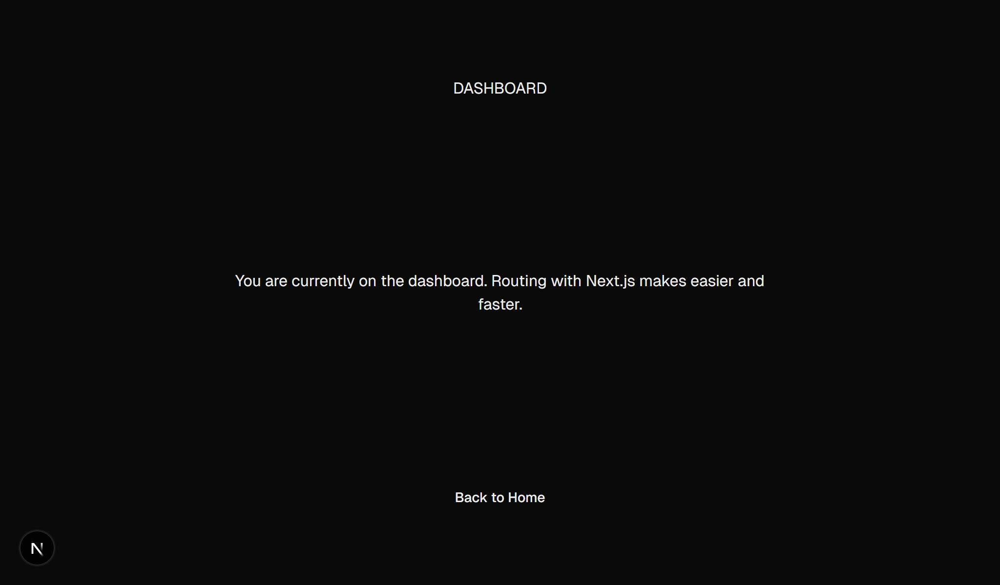

<a id="top"></a>

# Project Starting

**Next.js + Husky + Shadcn UI**

A Next.js project built with Husky for Git hooks and Shadcn UI for modern UI components.
It features basic routing with Next.js, clean UI integration with Shadcn, and Git commit linting workflow with Husky + Commitlint to ensure consistent development practices.

---

## ✨ Features
- 🏠 **Basic Routing**: Navigation between pages with Next.js App Router
- 🖱️ **Reusable Button**: Shadcn UI Button with Next.js `Link` support
- 🎨 **UI Components**: Prebuilt and customizable Shadcn UI components
- 📄 **Dashboard Page**: Simple dashboard with description and back-to-home button
- ⚡ **Fast Build**: Powered by Bun for lightning-fast install & dev
- 🛡 **Git Hooks**: Husky integration with lint-staged & commitlint

## 🛠️ Built With
- **Next.js (App Router)** – React framework with server components
- **React** – UI library
- **TypeScript** – Typed JavaScript
- **Shadcn UI** – Modern component library
- **Tailwind CSS** – Utility-first CSS framework
- **Bun** – Fast JavaScript runtime
- **Husky** – Git hooks for linting & commit checks
- **ESLint + Prettier** – Code quality and formatting


## 📷 Screenshot

### Initial View Dekstop


### Routing Page /dashboard


<p style="text-align: center; margin-top: 20px;">
  <a href="#top">⬆️ Back to Top</a>
</p>

___
## 🚀 Getting Started

### Install dependencies
```bash
bun install
```

### Run the development server
```bash
bun dev
```

### Run the production build
```bash
bun build
bun start
```
---

## Project Structure

```ts
└── 📁docs   // Documentation directory
    └── 📁images   // Images for docs
        ├── 01-initial-view-dekstop.png
        └── 02-routing-page-dashboard.png
└── 📁public   // Public assets
    ├── file.svg
    ├── globe.svg
    ├── next.svg
    ├── vercel.svg
    └── window.svg
└── 📁src   // Main source directory
    └── 📁app   // Next.js app router
        ├── 📁dashboard
        │   └── page.tsx
        ├── favicon.ico   // Favicon
        ├── globals.css   // Global styles
        ├── layout.tsx    // Root layout
        └── page.tsx      // Home page
    └── 📁components
        └── 📁ui   // Shadcn UI components
            └── button.tsx
    └── 📁lib
        └── utils.ts      // Utility functions
├── .gitignore            // Git ignore file
├── bun.lock              // Bun lock file
├── components.json       // Shadcn Components configuration
├── eslint.config.mjs     // ESLint configuration
├── next-env.d.ts         // Next.js TypeScript env types
├── package.json          // Project configuration
├── postcss.config.mjs    // PostCSS configuration
├── README.md             // Project documentation
└── tsconfig.json         // TypeScript configuration
```

<p style="text-align: center; margin-top: 20px;">
  <a href="#top">⬆️ Back to Top</a>
</p>